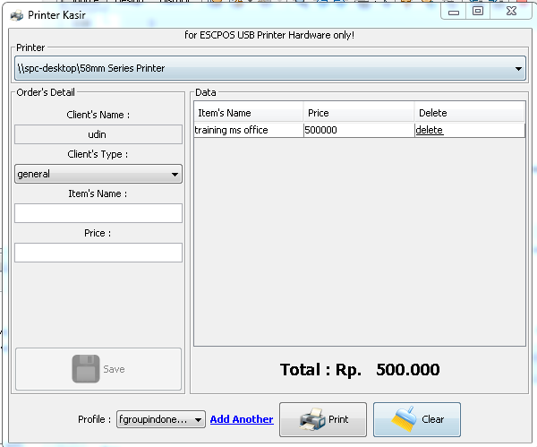
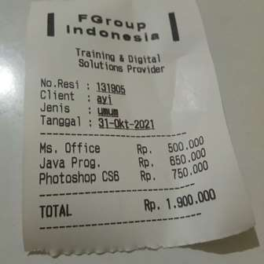

# Printer Kasir

### Main Program :

## First Notice!

This desktop tiny app will help you to manage several basic CASHIER operations such as :
1. Add & Delete transaction
2. Printing into receipt
3. Manage Profile (company logo, title, and address)

## Computer Requirements:

1. Any Processor with 2.0 Ghz
2. 128MB of RAM
3. 82kb of Harddisk freespace (very tiny)
4. Windows 7 and above

Thanks for everything! And if you need additional app or small utility to be deployed, please contact our official email for more details!

*happy printing!!*

Please donate with a better value. Your donation amount (cash) will make a difference - improve the quality of our file sharing community to help more people.

**(c) FGroupIndonesia team, 2021.**

